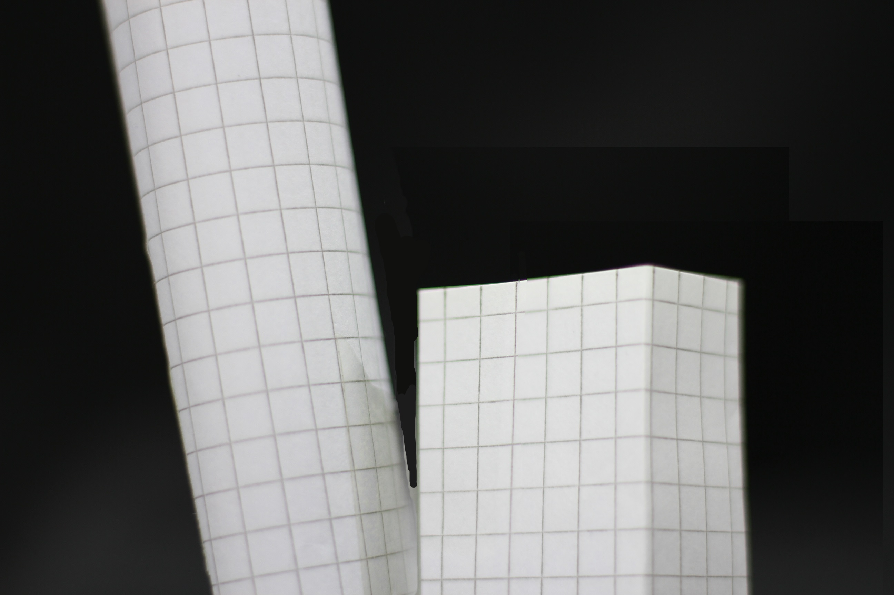
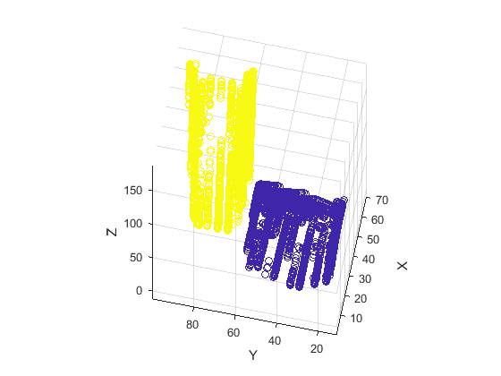
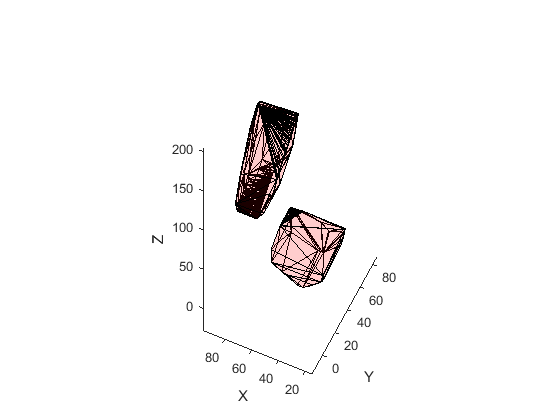

# 3D Mapping of Objects from a Single Camera Angle

This project was proposed at the Stokes modelling workshop 2017 at the National University of Ireland Galway. The aim of this project was to create a method of gaining depth information about a scene using only a series of shallow-depth-of-field shots. The photographs used were taken at regular intervals by a camera moving along one dimension towards the scene, bringing different regions into focus. The full project proposal is included in this repo as [*problemStatement.pdf*](problemStatement.pdf). The final presentation of results is also included as [*presentation.pdf*](presentation.pdf).

## Getting Started

### Prerequisites

To run this program MatLab and MatLab's image processing package must must first be installed.

### Running the program

To run the program first select which outputs you would like to see by toggling the settings in *mapping.m*.
```
% settings
do_printEdges = 1;
do_textured_plot = 0;
do_scatterplot = 0;
do_clustered_scatterplot = 0;
do_mesh = 0;
```

Then select how many objects are in the images being mapped by changing
```
n_objects = 2;
```
The sample images included contain two objects.

Now, run the program by running *mapping.m*. When prompted select the folder containing the images to be mapped. If *do_textured_plot* has been selected, you will also be prompted to select an image to use for the texturing.

### Demo files

Included in this repo are demo files which can be used to see the results. On running, select the *demo_pictures* folder as the images and *demo_texture.JPG* as the texture.

### Sample outputs

#### Demo scene


#### Grouped scatterplot


#### Meshing


## Contributors
* [Luca Manzari](https://github.com/luke-skywalker)
* [Jack Collins](https://github.com/jackmpcollins)
* [David Colson](https://github.com/DavidColson)
* Cliona Donnelly
* [Sam Geraghty](https://github.com/diphazi)
* Treacy Hanley
* Sam Kamperis
* Faik Mayah
* Suman Samantray
